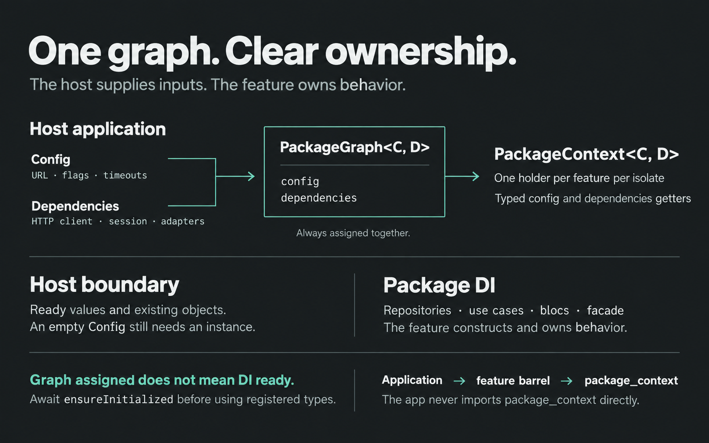
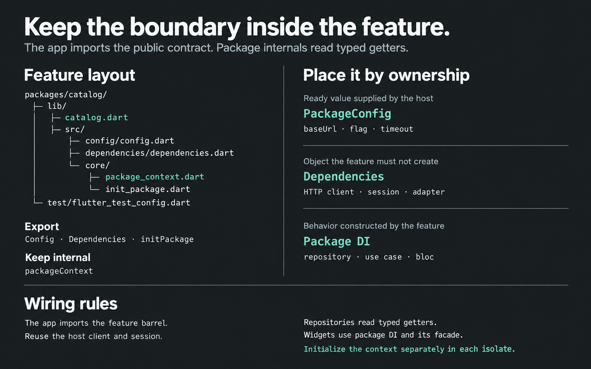
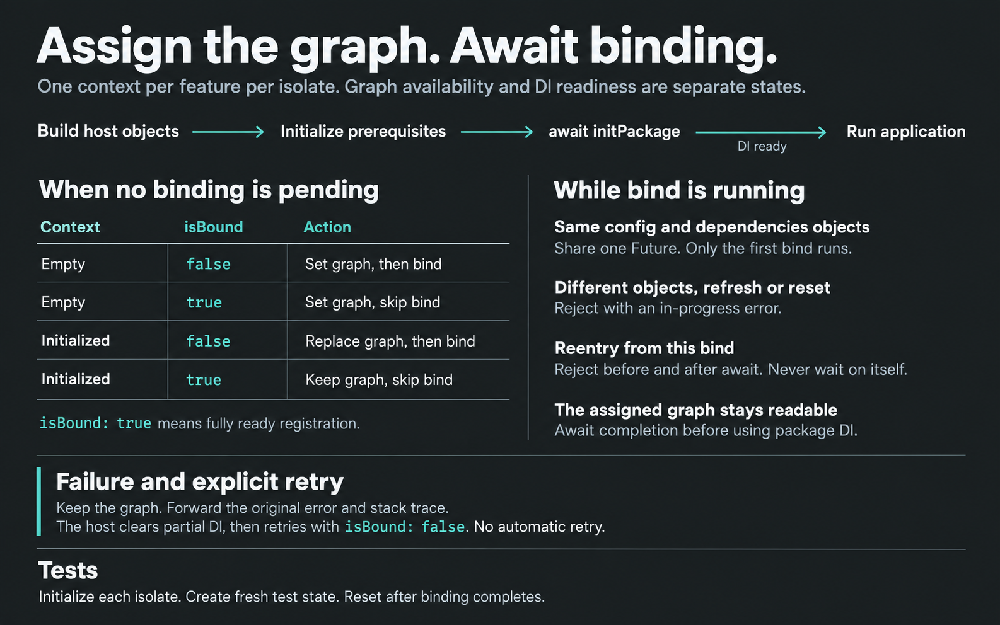

# package_context

Holds one config and one dependency graph for a feature package.

The app initializes the package at startup. After that the package reads typed
`config` and `dependencies`. The app never imports `package_context`.



This is not a DI container. Put host values and host objects here. Keep
repositories, use cases, and blocs in the package's own container.

| Type | Content | Examples |
|---|---|---|
| `PackageConfig` | Values from the host | URL, keys, flags |
| `PackageDependencies` | Objects the package must not create | HTTP client, session, adapters |
| `PackageGraph` | Config and dependencies together | The only valid initialized state |

Keep one `PackageContext` per feature package in each isolate. New isolates
have separate global state and must initialize their own context.

An assigned graph makes `config` and `dependencies` available. It does not
mean package DI is ready: await `ensureInitialized` before using registered types.

An empty `Config` is fine. The instance is still required.

## Install

Add the dependency to the **feature package**, not to the app:

```yaml
dependencies:
  package_context: ^2.2.0
```

In a monorepo:

```yaml
dependencies:
  package_context:
    path: ../package_context
```

## Wire a feature package

The samples use a fictional `catalog` package. The complete
[runnable example](example/package_context_example.dart) demonstrates the same
config, dependencies, getters, and bootstrap with an in-memory host.



### Layout

```
packages/catalog/
  lib/catalog.dart
  lib/src/config/config.dart
  lib/src/dependencies/dependencies.dart
  lib/src/core/package_context.dart
  lib/src/core/init_package.dart
  test/flutter_test_config.dart
```

Export `Config`, `Dependencies`, and `initPackage`. Do not export `packageContext`.

```dart
export 'src/config/config.dart';
export 'src/core/init_package.dart';
export 'src/dependencies/dependencies.dart';
```

### Config

Import `package_context` with an alias. The app resolves flavors and
`--dart-define`. The package receives ready values.

```dart
import 'package:package_context/package_context.dart' as package_context;

final class Config extends package_context.PackageConfig {
  final Uri baseUrl;
  final bool isEnabled;

  const Config({
    required this.baseUrl,
    required this.isEnabled,
  });
}
```

No values? Keep an empty config:

```dart
final class Config extends package_context.PackageConfig {
  const Config();
}
```

### Dependencies

Host infrastructure and host implementations of package interfaces go here.
Objects the package constructs itself do not.

```dart
import 'package:package_context/package_context.dart' as package_context;

abstract interface class ApiClient {
  Future<List<int>> get(Uri url);
}

abstract interface class Session {
  String? get userId;
}

final class Dependencies extends package_context.PackageDependencies {
  final ApiClient apiClient;
  final Session session;

  const Dependencies({
    required this.apiClient,
    required this.session,
  });
}
```

- Interface in the package, implementation in the app → `Dependencies`
- Host client, retry, clock → `Dependencies`
- Package-built repository, use case, bloc → package DI

### Context

One context per isolate. Typed getters. Internal code imports the getters, not
`package_context`.

```dart
import 'package:package_context/package_context.dart' as package_context;

final packageContext = package_context.PackageContext<Config, Dependencies>();

Config get config => packageContext.config;

Dependencies get dependencies => packageContext.dependencies;
```

### initPackage

Call it after the host can build every `Dependencies` field.

When no binding operation is pending:

| Context | `isBound` | Action |
|---|---|---|
| Empty | `false` | Set the graph, then bind |
| Empty | `true` | Set the graph without binding |
| Initialized | `false` | Replace the graph, then bind |
| Initialized | `true` | Keep the previous graph without binding |

Do not call `initialize` twice. Use `refresh` or `ensureInitialized`.

```dart
Future<void> initPackage({
  required Config config,
  required Dependencies dependencies,
}) {
  return packageContext.ensureInitialized(
    graph: package_context.PackageGraph(
      config: config,
      dependencies: dependencies,
    ),
    isBound: getIt.isRegistered<CatalogFacade>(),
    bind: configureDependencies,
  );
}
```

`configureDependencies` registers package-owned types and can return `void` or
`Future<void>`. The registration check must become `true` only when all package
registration has completed. A partially registered facade is not sufficient.

While binding is pending, external calls with identical `config` and
`dependencies` objects receive the same `Future`. A new `PackageGraph` wrapper
is allowed; the objects themselves are compared by identity, not equality.
Only the first callback runs, even if a later caller supplies `isBound: true`.

A different graph or reentry from the pending operation's own `bind` returns a
failed `Future` with `PackageContextInitializationInProgress`. Reentry is rejected
both before and after `await`, so binding cannot wait on its own completion.
During binding, `refresh` and `reset` throw the same error synchronously.
`initialize` still throws `PackageContextAlreadyInitialized`.

The graph is available throughout binding. If binding fails, the graph stays
assigned and the original error and stack trace reach callers. The library does
not roll back the host container or retry automatically. The host must clear
partial registrations, then explicitly retry with `isBound: false`. Await the
result before reading package-owned registrations.



### Data layer

Read the getters. Do not take host objects in constructors.

```dart
class CatalogRepository {
  const CatalogRepository();

  Future<List<int>> fetchItems() {
    return dependencies.apiClient.get(config.baseUrl.resolve('/items'));
  }
}
```

UI talks to package DI. Widgets do not read `packageContext`.

## Wire the application

Import the feature barrel. Do not import `package_context`.

```dart
import 'package:catalog/catalog.dart' as catalog;
```

Order:

```
main
  → build host objects
  → init packages that catalog needs
  → catalog.initPackage(config, dependencies)
  → run the app
```

```dart
await catalog.initPackage(
  config: catalog.Config(
    baseUrl: Uri.parse('https://api.example.com'),
    isEnabled: true,
  ),
  dependencies: catalog.Dependencies(
    apiClient: appApiClient,
    session: AppSession(
      auth: auth,
    ),
  ),
);
```

Pass the same host objects you already use. Do not create a second client
"for this package".

The interface lives in the feature package. The implementation lives in the
app.

```dart
class AppSession implements catalog.Session {
  final Auth auth;

  @override
  String? get userId => auth.currentUserId;

  AppSession({
    required this.auth,
  });
}
```

## Tests

Assign fresh host objects in `setUp` and call `packageContext.reset()` in
`tearDown`. Await pending binding before teardown. Each isolate needs its own
initialization.

[Test bootstrap](example/test_bootstrap.dart) contains the compiled setup with
an in-memory client and session. [Bootstrap tests](test/test_bootstrap_test.dart)
show the `setUp`/`tearDown` wiring and verify repository reads and fresh objects
after reset. `Uri.parse` runs at runtime, so the containing `Config` invocation
is not `const`.

## Contract

| API | Behavior |
|---|---|
| `isInitialized` | `true` when a `PackageGraph` is set; does not report DI readiness |
| getters | `PackageContextNotInitialized` if empty |
| `initialize` | Assigns once. `PackageContextAlreadyInitialized` if already set |
| `refresh` | Sets or replaces the graph; throws while binding is pending |
| `ensureInitialized` | Applies the four-state table; shares pending binding for identical host objects |
| `reset()` | Tests only. Clears the graph; throws while binding is pending |

Pending mutations and conflicting or reentrant initialization use
`PackageContextInitializationInProgress`. A binding error leaves the graph
assigned and permits explicit retry after host cleanup.

## Development

The supported Dart SDK range remains `>=3.13.2 <4.0.0`.
[CI](.github/workflows/ci.yml) checks both Dart 3.13.2 and the stable channel on
pull requests to `main` and pushes to `main`.

Run `make check` to resolve dependencies, check formatting without rewriting
source files, analyze, test, and run the main example. `make format` applies
formatting changes explicitly.

## Rules

1. The feature package depends on `package_context`. The app does not.
2. One `packageContext` per package in each isolate.
3. Config holds values. Dependencies hold host objects. Both travel as `PackageGraph`.
4. The public barrel exports `Config`, `Dependencies`, `initPackage`.
5. Data and domain read getters. UI does not.
6. The app calls `initPackage` after every dependency exists.
7. Host adapters live in the app.
8. Do not read `String.fromEnvironment` inside the package.
9. Do not call `initialize` twice. Use `refresh` or `ensureInitialized`.

- Repository: [github.com/pchkauu/package_context](https://github.com/pchkauu/package_context)
- Issues: [github.com/pchkauu/package_context/issues](https://github.com/pchkauu/package_context/issues)
- License: MIT
